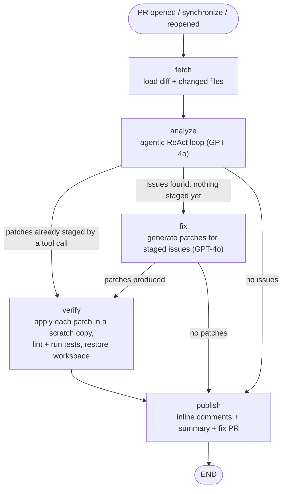
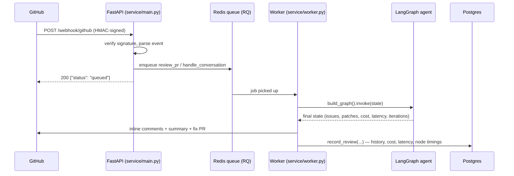

# ai-code-reviewer

An AI agent that reviews GitHub pull requests: it finds bugs/security/performance/style
issues, proposes and verifies patches, opens a fix PR, remembers what reviewers have
already dismissed, and answers follow-up questions left on its own comments — all
built on a [LangGraph](https://langchain-ai.github.io/langgraph/) state machine backed
by GPT-4o.

It ships in two deployment shapes that run the **exact same agent graph**:

1. **CI mode** — a GitHub Actions workflow that runs the agent once per PR event, no infrastructure to host.
2. **Hosted service mode** — a FastAPI webhook + Redis queue + worker + Postgres + a Next.js dashboard, for running the agent continuously across many repos with history, cost, and quality tracking.

---

## How the review works

Every PR review — whether triggered by CI or by the hosted webhook — runs the same
five-node LangGraph:



**`analyze`** is not a single LLM call — it's a tool-calling loop (max iterations
capped, tracked as `iteration_count` / `hit_max_iterations` on the run) where the model
decides which of these tools to call, in what order, before producing its final list of
issues:

| Tool | What it does |
|---|---|
| `search_codebase` | Regex/literal search across the workspace's source files |
| `read_file` | Read a file's full contents |
| `run_tests` | Run `pytest`, optionally scoped to one file |
| `search_similar_bugs` | Search this repo's GitHub issues for similar past reports |
| `web_search` | Look up matching CVEs via the NVD database |
| `check_bug_history` | Find past commits on this file whose message starts with `fix:` |
| `check_author_style` | Look up the file's last editor and any notes on findings they've dismissed before |
| `search_semantic_memory` | Embedding search over past findings and their outcome (Pinecone, optional) |
| `apply_fix` | Stage a minimal verbatim patch (validated, not written to disk yet) |
| `post_comment` | Post a comment directly on the PR |

`verify` is the safety gate: every staged patch is applied to a **scratch copy** of the
workspace, linted/tested, and the real workspace is restored regardless of outcome — a
patch only reaches `publish` marked `verified=True` if it survived that.

### Hosted service request flow



---

## Key features

- **Agentic analysis** — GPT-4o tool-calling loop, not a single-shot prompt; see table above.
- **Verified fixes** — patches are lint/test-checked in a scratch copy before ever being proposed; unverified patches are reported but not opened as a PR.
- **Approve/reject fix PRs by comment** — a fix PR carries a marker + an approval-prompt comment; replying `approve` or `reject` on that thread (via the `issue_comment` webhook, `agent/nodes/fix_pr_decision.py`) merges or closes it, but only for commenters with write access to the repo (checked via the GitHub API, not assumed). Nothing merges without that explicit approval — the bot never merges on its own. Note: `GITHUB_TOKEN` should belong to a dedicated bot account or GitHub App, not a human reviewer's own personal token — the "ignore my own comments" guard compares the comment author to the token's identity, so a shared token would block that person from ever approving.
- **Memory & learning** (`agent/memory_store.py`) — findings are fingerprinted; a 👎 reaction on a bot comment is scanned and recorded as a dismissal on a dedicated `ai-review-memory` git branch (`memory.json`), so the same finding is never reported again, and a per-author `dismiss_counts` profile feeds the `check_author_style` tool.
- **Conversation mode** (`agent/nodes/conversation.py`) — a reply to one of the bot's own review comments is classified as `question` / `disagreement` / `other`; questions get an explanation, disagreements get acknowledged and recorded as a dismissal.
- **Semantic memory** (`agent/pinecone_store.py`, optional) — past findings embedded in Pinecone so `search_semantic_memory` can match by meaning, not just keyword; the agent degrades gracefully (skips the tool) if `PINECONE_API_KEY` is unset.
- **Cost tracking** — every OpenAI call's cost is computed (`agent/llm_cost.py`) and rolled up per review (`cost_usd`) and per repo (`/api/reviews/cost`).
- **Cost circuit breakers** — two independent caps, since they guard against different failure modes: `MAX_COST_PER_REVIEW_USD` (default $0.50) stops a single review's own ReAct loop early if one huge diff or a chatty tool-calling run burns through it; `DAILY_COST_CAP_USD` (default $5.00) is a rolling 24h cap on total spend across every repo this deployment reviews — once hit, new reviews are skipped (with a PR comment explaining why, not silently) until usage rolls off.
- **Latency & loop tracking** — wall-clock latency and per-node timing (via LangSmith trace child-runs) plus `iteration_count` / `hit_max_iterations` are recorded per review and surfaced on the dashboard (`/api/reviews/latency`).
- **LLM-as-judge eval** — offline (`eval/run_offline_eval.py`, a golden dataset with known expected issues, weekly + on-demand CI) and online (a sampled fraction of real production reviews, judged for plausibility with no ground truth needed) — both use the same judge (`eval/judge.py`).
- **LangSmith tracing** — optional; when `LANGCHAIN_TRACING_V2=true` is set, every OpenAI call and every graph node is traced, and the trace URL is stored per review.
- **Dashboard** (`dashboard/`) — Next.js app: repo selector, review history table, cost/latency/false-positive/eval-quality stat tiles, per-review node-latency breakdown on hover.

---

## Repo layout

```
agent/                  the LangGraph agent (shared by both deployment modes)
  schemas.py             Pydantic models: Issue, Patch, ReviewResult, AgentState
  graph.py                wires fetch -> analyze -> fix -> verify -> publish
  github_client.py       PyGithub wrapper (auth, file/diff access, comments, PRs)
  memory_store.py        dismissal + author-style memory, stored on a git branch
  pinecone_store.py      optional semantic memory over past findings
  llm_client.py          OpenAI client (LangSmith-wrapped when tracing is on)
  llm_cost.py             per-call cost computation
  fingerprint.py          stable id for an issue (file+category+title) for dismissal tracking
  main.py                 CI-mode entrypoint (reads PR_* env vars, runs one review)
  conversation_main.py    CI-mode entrypoint for the conversation-mode workflow
  nodes/                  fetch / agentic_analyze / fix / verify / publish / conversation / fix_pr_decision
  tools/                  agent_tools.py (the ReAct tool implementations), detect_lang.py

service/                 hosted deployment: webhook -> queue -> worker -> Postgres -> API
  main.py                 FastAPI app (webhook + reviews API)
  worker.py                RQ worker entrypoint (SimpleWorker on Windows, Worker elsewhere)
  jobs.py                  job handlers: handle_review_pr, handle_conversation
  webhooks/                signature verification + GitHub event parsing
  queue/                   RedisJobQueue (+ InMemoryJobQueue fallback for local/dev)
  reviews_repo.py           Postgres reads/writes (history, cost, latency, eval, false-positive rate)
  reviews_router.py         GET /api/reviews, /stats, /cost, /eval, /latency, /repos
  schema.sql                reviews / review_issues / eval_samples tables

dashboard/               Next.js dashboard reading service/'s API
eval/                    golden dataset, LLM-as-judge, offline eval runner
tests/                   pytest suite (agent/ and service/ mirrored)
.github/workflows/       code-review.yml, conversation.yml, eval.yml, tests.yml
docker-compose.yml       local Redis + Postgres for the hosted service
```

---

## Running it

### Option A — CI mode only (no infrastructure)

Copy `.env.example` values into GitHub Actions repo secrets (`OPENAI_API_KEY`,
`GITHUB_TOKEN`) and `.github/workflows/code-review.yml` runs automatically on every
`pull_request` event. Nothing to host.

### Option B — hosted service (webhook-driven, multi-repo, dashboard)

```bash
# 1. infra
docker compose up -d          # Redis on :6390, Postgres on :5442

# 2. python deps
python -m venv .venv && .venv/Scripts/activate   # (or source .venv/bin/activate)
pip install -r service/requirements.txt

# 3. configure
cp .env.example .env                              # OPENAI_API_KEY, GITHUB_TOKEN
# create service/.env with: GITHUB_WEBHOOK_SECRET, REDIS_URL, DATABASE_URL

# 4. run
python -m uvicorn service.main:app --reload --port 8000
python -m service.worker

# 5. expose it to GitHub (local dev) and register the webhook
ngrok http 8000
# repo Settings -> Webhooks -> Payload URL = https://<ngrok>/webhook/github,
# content type application/json, secret = GITHUB_WEBHOOK_SECRET, events: pull_request,
# pull_request_review_comment, issue_comment

# 6. dashboard
cd dashboard && npm install && npm run dev        # http://localhost:3000
```

### Environment variables

| Variable | Where | Required | Purpose |
|---|---|---|---|
| `OPENAI_API_KEY` | root `.env` | yes | LLM calls |
| `GITHUB_TOKEN` | root `.env` | yes | PyGithub auth (PR reads, comments, fix PRs) |
| `GITHUB_WEBHOOK_SECRET` | `service/.env` | yes (hosted) | HMAC verification of inbound webhooks |
| `REDIS_URL` | `service/.env` | yes (hosted) | job queue |
| `DATABASE_URL` | `service/.env` | yes (hosted) | review history storage |
| `PINECONE_API_KEY` / `PINECONE_INDEX_NAME` | `.env` | no | enables `search_semantic_memory`; skipped gracefully if unset |
| `LANGCHAIN_TRACING_V2` / `LANGCHAIN_API_KEY` / `LANGCHAIN_PROJECT` | `.env` | no | LangSmith tracing + per-node latency capture |
| `ONLINE_EVAL_SAMPLE_RATE` | `service/.env` | no (default `0.15`) | fraction of production reviews sampled for LLM-judge quality checks |
| `MAX_COST_PER_REVIEW_USD` | `.env` | no (default `0.50`) | hard cap on a single review's own OpenAI spend |
| `DAILY_COST_CAP_USD` | `service/.env` | no (default `5.00`) | rolling 24h cap on total spend across every repo; new reviews are skipped once reached |

`load_dotenv()` is called with explicit paths in every entrypoint (root `.env` then a
local `.env` if present) — see the comment in `service/main.py` — because an unqualified
call resolves relative to the *calling file's* directory, not the CWD.

---

## Testing & eval

```bash
pytest tests/ -q                    # unit + integration (real Postgres via TEST_DATABASE_URL)
python -m eval.run_offline_eval     # golden-dataset recall / false-positive rate, gated in CI
```

`tests.yml` runs on every push/PR against a real Postgres service container.
`eval.yml` runs the offline eval weekly plus on-demand, to catch silent quality drift
from model or prompt changes without spending API budget on every push.

---

## Models

| Node | Model | Why |
|---|---|---|
| `analyze` (tool-calling loop) | `gpt-4o` | offline eval showed `gpt-4o-mini` recall dropped to 50–67% with a 25–37.5% false-positive rate vs. `gpt-4o`'s 83.3%/16.7% — reverted after measuring, not guessing |
| `fix` | `gpt-4o` | same reasoning — patch quality matters as much as detection |
| `conversation` classification | `gpt-4o-mini` | short classification task (question/disagreement/other), not generation-heavy |
